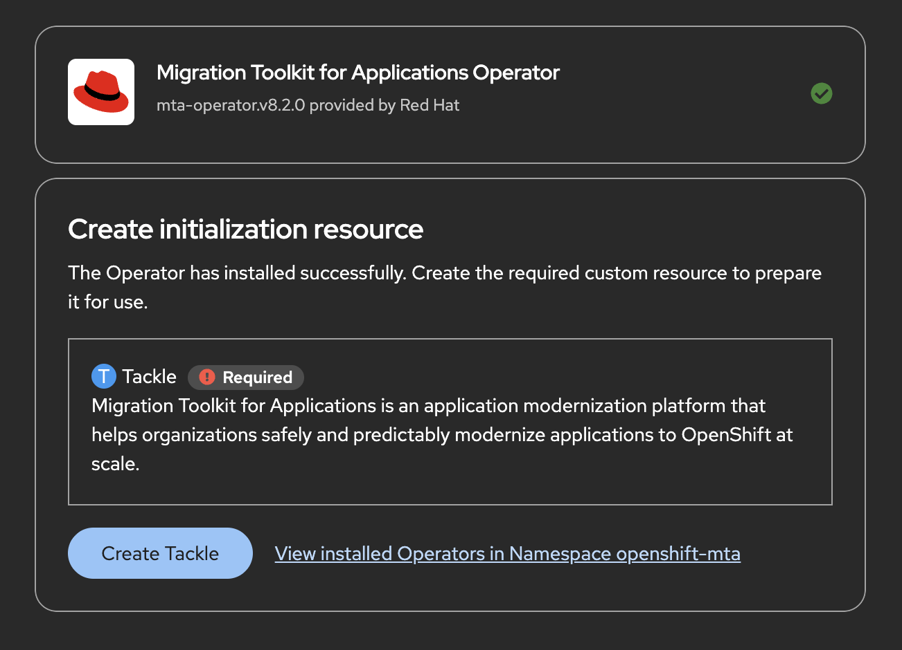

= Modernizing Applications with Migration Toolkit for Applications
:navtitle: MTA Overview

Many organizations already have large portfolios of existing applications built on traditional application servers and legacy frameworks. While these applications continue to provide business value, they can become increasingly difficult to maintain, scale, and deploy in modern Kubernetes environments.

In this lesson, you'll learn how the *https://developers.redhat.com/products/mta[Red Hat Migration Toolkit for Applications (MTA)]* helps organizations assess, plan, and modernize existing applications so they can take advantage of cloud-native platforms such as Red Hat OpenShift.

TIP: Think about the applications running in your own organization. Which ones would benefit most from modernization?

== Why Modernize Applications?

Application modernization is the process of updating existing applications to use modern runtimes, frameworks, and deployment models without necessarily rewriting them from scratch.

Organizations modernize applications to:

* Accelerate software delivery
* Improve developer productivity
* Reduce operational and maintenance costs
* Simplify security updates and compliance
* Prepare applications for containers and Kubernetes
* Adopt modern cloud-native development practices

[IMPORTANT]
====
Modernization is not always about rewriting an application. Many organizations achieve significant value by incrementally modernizing existing applications while preserving their business logic.
====

== What is Migration Toolkit for Applications?

*https://developers.redhat.com/products/mta[Red Hat Migration Toolkit for Applications (MTA)]* is a Red Hat solution that helps organizations analyze existing applications and identify the changes required to migrate them to modern runtimes and platforms.

Rather than manually reviewing thousands of source files, MTA automatically scans an application and produces detailed migration guidance, allowing development teams to modernize applications in a predictable and repeatable way.

== How MTA Helps Modernize Applications

MTA provides several capabilities that simplify application modernization.

[cols="1,3",options="header"]
|===
|Capability |Purpose

|Application Analysis
|Scans application source code, configuration files, and dependencies to identify migration issues.

|Migration Rules
|Uses pre-built rule sets to detect changes required for different migration targets, frameworks, and runtimes.

|Portfolio Assessment
|Analyzes multiple applications to help organizations prioritize modernization efforts across large application portfolios.

|Web Console
|Provides a centralized interface for managing modernization projects, reviewing reports, and tracking migration progress.

|CLI
|Allows developers and CI/CD pipelines to perform automated application analysis as part of the software delivery workflow.
|===

== Modernization Strategies

Not every application requires the same level of modernization.

Depending on business requirements, organizations typically adopt one of the following approaches.

[cols="1,3",options="header"]
|===
|Strategy |Description

|Rehost
|Move an application to a new infrastructure with little or no code changes. The application architecture remains unchanged.

|Replatform
|Move the application to containers and OpenShift with minimal code modifications while adopting a supported runtime.

|Refactor
|Redesign the application to adopt cloud-native architectures such as microservices, event-driven services, or modern Java frameworks like Quarkus.
|===

image::path.png[align="center",width="500"]

As modernization effort increases, organizations gain greater flexibility, scalability, and cloud-native capabilities.

== Supported Red Hat Runtimes

After modernization, applications typically run on one of Red Hat's supported runtimes.

[cols="1,3",options="header"]
|===
|Runtime |Typical Use Case

|Red Hat build of Quarkus
|Build modern Kubernetes-native Java applications with fast startup and low memory consumption.

|JBoss Enterprise Application Platform (EAP)
|Run enterprise Jakarta EE applications with long-term support.

|Red Hat build of Spring Boot
|Develop modern Spring Boot applications with enterprise support from Red Hat.

|Node.js, .NET, and Go Runtimes
|Support modernization across polyglot application environments.
|===

== MTA in the Software Factory

Application modernization is another stage within the Software Factory.

Instead of creating a new application, developers begin with an existing application and use MTA to prepare it for modern application platforms.

The modernization workflow follows these steps:

. Analyze the legacy application using MTA.
. Review migration reports and recommended code changes.
. Modernize the application to use a supported runtime.
. Commit the updated source code to Git.
. Build and validate the application using the existing CI pipeline.
. Deploy the application through the GitOps workflow.
. Continue operating the application using the same Software Factory used for cloud-native applications.

This allows organizations to modernize existing applications while continuing to use the same standardized development and deployment processes.

[NOTE]
====
Migration Toolkit for Applications does not automatically rewrite applications. Instead, it analyzes existing applications, identifies migration issues, and provides actionable guidance that helps development teams modernize applications efficiently.
====

== Reflection

.Think about your own organization (Click to expand)
[%collapsible]
====
* Which applications are the best candidates for modernization?
* Would they require rehosting, replatforming, or refactoring?
* How could automated migration analysis reduce modernization effort?
* How would integrating MTA into your Software Factory improve software delivery?
====

== Check Your Understanding

.Quiz Time! (Click to expand)
[%collapsible]
====

Which statement best describes the purpose of Migration Toolkit for Applications?

A. Automatically converts any application into a microservice.

B. Analyzes existing applications, identifies migration issues, and provides guidance for modernization.

C. Replaces CI/CD pipelines during software delivery.

D. Deploys applications directly to OpenShift.

*Answer*

**B** — MTA analyzes applications, identifies migration issues, estimates modernization effort, and provides recommendations to help development teams modernize applications.
====